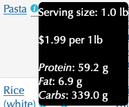
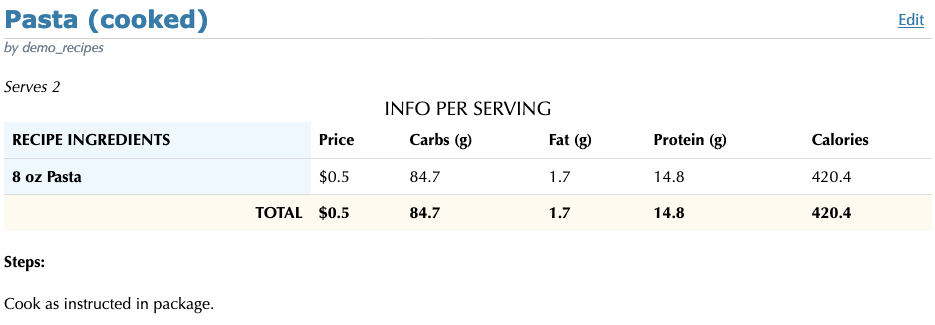
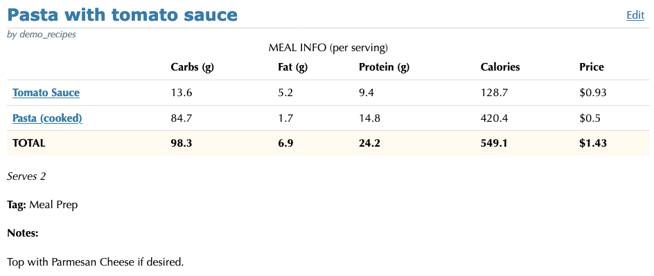
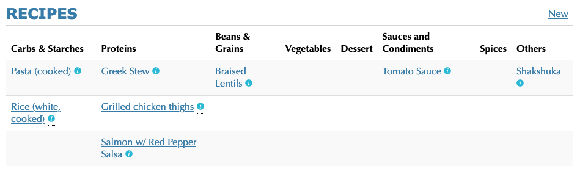

# MEAL PREP APP

## OVERVIEW

*This web app is currently deployed on [http://recipe-manager.us-east-1.elasticbeanstalk.com/recipes/](http://recipe-manager.us-east-1.elasticbeanstalk.com/recipes/ "Meal Prep App")*

A web app that allows users to record their recipes, automatically calculating their price and macronutrient information per serving.

The app provides a pre-populated ingredient database, with the following information:



*Example of the info in ingredient in the database.*

When creating a recipe, the user selects the ingredients and its quantity used, along with the number of yielded servings. The app automatically converts the units of the ingredients in the database to the units stipulated in the recipe (all units are accepted, including grams, kg, ml, cup, etc.). For instance:



*Pasta was inserted in lbs in the ingredients database, but in ounces in the recipe above. The app will convert it to calculate its price and macronutrient info.*


Users can create meals, which are a collection of recipes. Meals also convert servings from recipes automatically. For instance:



*The recipe "Tomato Sauce" yields 16 servings, but the meal "Pasta with tomato sauce" yields 2 servings. The app calculates the price and macronutrients accordingly.*

</br></br>



*All ingredients, recipes, and meals are organized by tag, displayed in a table so that the user can easily browse through them.*


## USER MANAGEMENT

Recipes and meals are unique to each user. In order to create recipes and meals, or to edit ingredients, the user has to be registered. Passwords are hashed and not stored directly in the database. 

Unregistered users can see some demo recipes that I added (I have prepared all of them myself in the past few weeks!).


## TESTING

I have implemented some unit and functional tests using unittest and flask-testing libraries.

# TO RUN

On recipe-manager folder, run:

```
docker build --no-cache
docker-compose up
```

and access the app on <code>localhost:4998</code>
